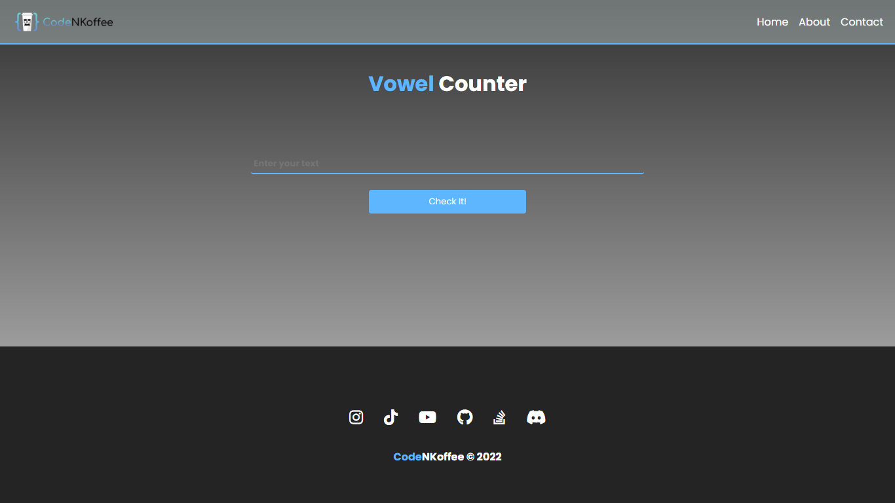

# Project Title

Vowel Counter Web App

## Description

The main purspose for this project was is to test my JavaScript skills in creating simple yet useful and fun app.

## Preview

---

---
---

## Getting Started

### Dependencies

* HTML, CSS and Vanilla JavaScript
* Social Icons imported from FONTAWESOME
* The "CodeNKoffee" logo used in the navigation bar is a property of CodeNKoffee and it is NOT for any Personal NOR Commercial Use. YOU CANNOT USE THIS logo or ANY other logo found in the assets file for your GitHub Projects or any other project - you can download it ONLY TO VIEW MY CODE with all the feautres it has to offer

### Installing

* Download the "index" HTML file, "style" CSS file and "app4.0" JavaScript file and the "Codenkoffee-08.png".
* Any JS file version 3.0 or lower is not required to view my full web app.

### Executing program

* Make sure to download all 3 files mentioned above with the logo and put them in a folder
* Open VSCode and open a new workspace and add that foler you just created.
* Go to line 8 in the HTML file to adjust the style file location and line 95 for the app file.
* Go to line 16 in the HTML file and adjust the logo location according to where you have put it
* Voila! Run the code and enjoy the functionality!
```
code blocks for commands
```

## Help

Any advise for common problems or issues.
```
command to run if program contains helper info
```

## Authors

Contributors names and contact info

ex. Hatem   
ex. [@codenkoffee](https://www.instagram.com/codenkoffee/)

## Version History

* 0.2
    * Various bug fixes and optimizations
    * See [commit change]() or See [release history]()
* 0.1
    * Initial Release

## License

This project's source code can be used foor personal use or GitHub projects EXCEPT for the logos.
